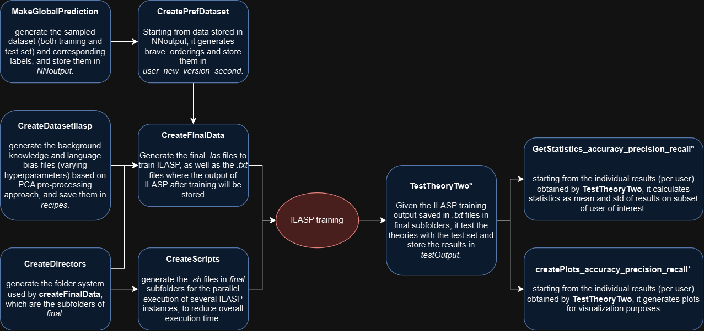
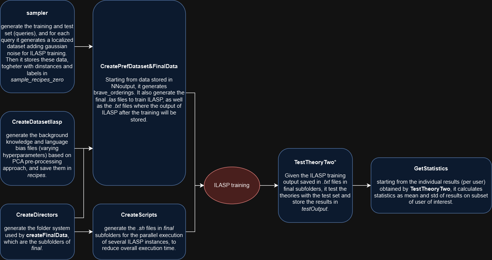

# ILASP as post-hoc method in a preference system

This project explores the use of ILASP as a post-hoc method for interpreting Black-Box (BB) models such as Neural Networks, Support Vector Machines, and K-Nearest Neighbors. 
The repository includes files for creating the dataset of recipes (with raw data sourced from the GialloZafferano website), along with several files documenting studies and experiments on both the data and the performance of the black-box models. 
Finally, it contains files related to experiments using ILASP.

# Related materials

A full description of the dataset can be found here: https://zenodo.org/records/14068000

A full description of the experiments involved in this project can be found on the following articles:

[1] D.Fossemò, F.Mignosi, L.Raggioli, M.Spezialetti, F.A.D'Asaro. Using Inductive Logic Programming to globally approximate Neural Networks for preference learning: challenges and preliminary results. Proceedings of BEWARE-22, co-located with AIxIA 2022, November 28-December 2, 2022, University of Udine, Udine, Italy. CEUR Workshop proceedings. Vol. 3319. 67:83. 2023. Url: https://ceur-ws.org/Vol-3319/paper7.pdf

[2] F. A. D’Asaro, M. Spezialetti, L. Raggioli, S. Rossi, Towards an inductive logic programming approach for explaining black-box preference learning systems, Proceedings of the International Conference on Principles of Knowledge Representation and Reasoning 17 (2020) 855–859. DOI: https://doi.org/10.24963/kr.2020/88

[3] D.Fossemò, F.Mignosi, M.Spezialetti, Analisi comparativa di approcci di machine learning per un sistema di preferenze di cibi. Three-year degree thesis (D.Fossemò). DOI: http://hdl.handle.net/20.500.12319/3727

[4] M.D'Aviero F.Mignosi, M.Spezialetti, Apprendimento Induttivo di Answer Set Program per un sistema di preferenze di cibi. Three-year degree thesis (M.D'Aviero). DOI: http://hdl.handle.net/20.500.12319/2304

# Guide to the code

The code was initially developed as a prototype, not originally intended for publication, so it may appear somewhat less polished.
To support the reproducibility of the experiments, we've added this section as a form of documentation.
For a comprehensive understanding, we recommend reviewing the related materials, particularly the dataset description and reference [1].
Lastly, please pay attention to the <b>NOTES</b> included in this guide, as they provide clarification on some of the more intricate aspects of the code.

## Dataset locations

In the "Related materials" section is possible to find the complete dataset with a full description.
That said, in the github folder is already present the dataset, and specifically:

- _./dataset_100_ contains the recipes dataset
- _./answers_dataset contains_ the preferences dataset
- _./answers_dataset/answers_of_return_ contains the survey of return dataset
- _./Ordinamenti_ contains the files actually used for the training for the preference learning task, specifically:
  - the three _.csv_ files contains the raw ranking of recipes returned by users
  - _dataset_coppie.txt_ contains the final samples of rankings in the form of pairwise comparison (where ; is the division for pair)
  - _output_file.txt_ contains the labels of "_dataset_coppie.txt_"
- _./matrixes_ contains a visual representation of the preferences of a user on his set of recipes, where yellow cells means "row _i_ preferred over column _j_", purple means "row _j_ preferred over column _i_", while aqua green indicate the uncertainty.

## PCA & Clustering

After creating the Recipe Dataset, we applied Principal Component Analysis (PCA) and k-means clustering to generate surveys for building the preference dataset. 
The code for this process is found in _./PCA&Clustering.py_. 
This script also generates several plots, which help determine the optimal number of Principal Components (PCs) to retain and the best 'k' value for k-means clustering. 
To prevent overwriting these plots with each execution, certain sections of the code are commented out. 
The generated plots and related data are stored in the _./PCA_data_ and _cluster_data_ folders.

## Support Vector Machines, k-Nearest Neighbors and Neural Networks

the code for training, tuning of hyper-parameter and testing of Support Vector Machines (SVM), k-Nearest Neighbors (kNN) and Neural Networks (NN), are stored respectively in _./SVMcode.py_, _KNNcode.py_ and "DEEPcodeFINAL.py".
When executing the code it will be asked if you want to perform tuning of hyper-parameters (1), or testing (2). 
While for SVM and kNN everything is automated, for NN you need to change valuse on lines 920 -- 926 to choose hyperparameters.
The results of SVM and kNN are reported in the folders _./SVM_ and _./KNN_. 
Neural Networks otherwise have two dedicated folders:

- in _./results_ are stored the results of the Neural Network used as Black Box in further experiments.
- in _./NN_data_ are stored the trained Neural Networks used in the further experiments.

Specifically, the Neural Network saved in _NN_data_ and used for further experiments has the following shape:

|                              | ***Activation Function*** | ***Nodes*** |
|:-----------------------------|:-------------------------:|:-----------:|
| <b>Input Layer</b>           |           tanh            |     64      |
| <b>Dropout</b>               |         10% rate          |      -      |
| <b>Hidden Layer</b>          |           relu            |     64      |
| <b>Dropout</b>               |         10% rate          |      -      |
| <b>Batch normalization</b>   |             -             |      -      |
| <b>Hidden Layer</b>          |          linear           |     64      |
| <b>Dropout</b>               |         10% rate          |      -      |
| <b>Output Layer</b>          |          Softmax          |      3      |
| <b>Optimization Function</b> |            SGD            |      -      |
| <b>Learning rate</b>         |          0.0005           |      -      |

<b>NOTE:</b> As described in Related Materials, the task solved by these models is a ternary classification task. The samples used are those reported in _./Ordinamenti/dataset_coppie.txt_, while corresponding labes are reported in _./Ordinamenti/output_file.txt_

## ILASP experiments

As outlined in the introduction, the primary goal of this work is to approximate BB models, specifically focusing on approximating the NN described in the previous section’s table. 
The experiments are organized into two main categories: global approximation, which aims to explain the model’s overall reasoning, and local approximation, which focuses on explaining specific queries. 
Each of these categories is further divided based on the PCA preprocessing approach defined in [1], which includes _direct PCA_ and _indirect PCA_. 
For each category, we conducted experiments on three sample datasets of different sizes: 45, 105, and 190 pairs.

<b>NOTE:</b> Due to an error, the folders containing datasets with 190 pairs (and related files) are labeled with the number 210. 
Unfortunately, we noticed this late in the project and decided to retain this naming for now. 
We plan to correct this in a future code update. 
As you go through this guide, please remember that any reference to folders labeled with 210 actually pertains to the dataset with 190 pairs.

### Folder Organization

From the point of view of folder organization, the code for global approximation is reported in _./ILASPcode/_, while the code for local one is reported in _./ILASPcode/local/local/_.
Both of these folders contain the folders _Data_, _Data8Component2Std_ and _Data17Component2Std_: the first one contains the data related to the experiment without using PCA, while the others contain the data when _Indirect PCA_ is used.
_Direct PCA_ is adopted only in the global case, and its data are stored in the folder _PCAexperiments_.
All these PCA subcase folders follow the same subfolder logic (which is designed to automate ILASP training as much as possible in all subcases), with some differences among global and local case.

#### Global folder organization

- _NNoutput_ contains the sampled dataset and the corresponding labels obtained using the BB. 
- _recipes_ contains the Background Knowledge (recipes dataset) and Language Bias, with different hyperparameters setting (i.e. maxp)
- _users_new_version_second_ contains the brave orderings extrapolated from sampled dataset to compose with file on _recipes_ to create the final desired _.las_ file for training.
  - <b>NOTE</b>: folders _users_ and _users_new_version_ contains the brave ordering with a slightly different syntax formatting. For the moment we left these folders as they are, but we are considering to delete them in future updates.
- _users_original_ contains the brave ordering extrapolate from original dataset to compose with file on _recipes_ to create the final desired _.las_ file for training.
- _final/users/_ contains the final files obtained from the composition of desired background knowledge, language bias and brave orderings. It also contains _.txt_ files where ILASP output are stored, and _.sh_ files to train ILASP on more train files in parallel (using different shells).
- _final_original/users/_ correspond to the previous folder but when we are using the original dataset instead of sampled ones.
- _testOutput_ contains the _.csv_ files which collect the result of ILASP (_testOutput_original_ for original dataset)
- _statistics_sampled_ contains the final results, which are the means of estimators with regard to the users experimented. (_statistics_original_ for original dataset)
- _plots_ contains the final results plotted

<b>NOTE:</b> Differently from _indirect PCA_ where sub-cases where collected by _Data8Components2Std_ and _Data17Components2Std_ folders, in _direct PCA_ his subcases are identified by a number (5, 10, 15, 20) at the end of the just presented sub-folders.

<b>NOTE:</b> Some folder, as _NNoutput_ are repeated even if they contains the same files (not always, for example sampled dataset in local approximation are different from global ones). We recognize this is not a best practice, and we will refactor in future version of the code.

#### Local folder organization

the folders _recipes_, _statistics_, _testOutput_ and _final_* are repeated, while the others are substituted with the folder _sampled_recipes_zero_, which subfolders are (for each sampled dataset and standard deviation used for the local approach):

- _distances_, in which are stored the files with computed distances between the queried pair and the pairs generated usig gaussian noise (used for ILASP training purpose)
- _las_files_, in which are stored the generated pairs using the gaussian noise
- _user_predictions_, in which are stored the labels given by the BB to the pairs generated using the gaussian noise
- .txt files, in which, for each experimented user, are reported the pairs for which is required an explanation.

\* <b>NOTE:</b> as can be visible, in the github repository is missing the _final_ folder, this was caused by the big memory space they occupies and storage policies of github.

<b>NOTE:</b> as in global case, some folder are repeated even if they contains the same files

### Code Organization

Similarly the Code organization is repeated among global and local cases, but with some slightly differences.

#### Global code organization

In the following image is reported the workflow for global approximator (an arrow identify a dependency of the targetted code to be executed after the starting code):

\* <b>NOTE:</b> as can be visible by github repository, there are varaints of this code, this since several experiments was made during the work. In the image are reported the mainly used codes.

<b>NOTE:</b> sometimes, in the code are reported folder references to read and write files. During the work these references were updated manually depending on the situation, also with help of search and substitute tools. 
An example is when referring "Data8Component2Std" folder instead of "Data17Component2Std" folder, or folders regarding the different sampled dataset, which are referred using their size as a sort of identifier.

#### Local code organization

As before, the local workflow is reported in the following image

The same note made for Global Code organization are valid in this case. Furthermore, an update to explain better the "getStatistics" in local case will arrive as soon as possible.

### Final ILASP code notes

Two key files in this project are _CompareStableModels.py_ and _ilaspReadWriteUtils.py_.
As you may notice in the GitHub repository, these files appear in multiple locations. 
Each copy has minor differences, so we recommend keeping them in place without deleting or moving them. 
Typically, each folder references the specific version of the file stored within it.

Lastly, some files are not detailed here, as they are used for smaller tasks or experiments that did not yield significant results. 
In future updates, these files may be removed to create a more streamlined repository."
